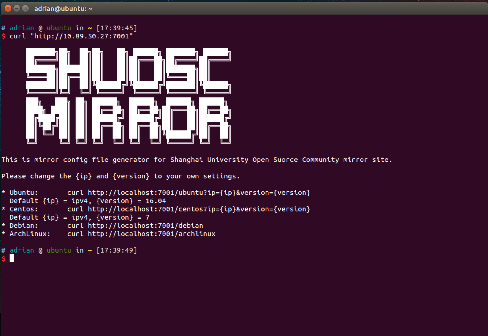
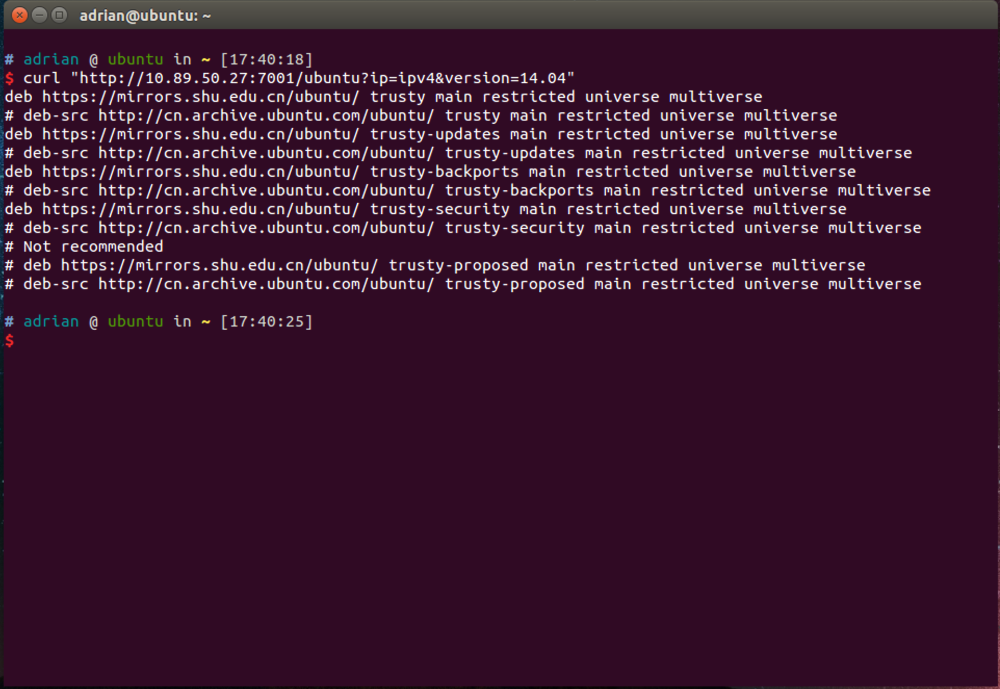

# Mirror Config Generator

Mirror config file generator for SHUOSC mirror site.
```
 ███████╗██╗  ██╗██╗   ██╗ ██████╗ ███████╗ ██████╗
 ██╔════╝██║  ██║██║   ██║██╔═══██╗██╔════╝██╔════╝
 ███████╗███████║██║   ██║██║   ██║███████╗██║     
 ╚════██║██╔══██║██║   ██║██║   ██║╚════██║██║     
 ███████║██║  ██║╚██████╔╝╚██████╔╝███████║╚██████╗
 ╚══════╝╚═╝  ╚═╝ ╚═════╝  ╚═════╝ ╚══════╝ ╚═════╝
 ███╗   ███╗ ██╗ ██████╗  ██████╗  ██████╗ ██████╗ 
 ████╗ ████║ ██║ ██╔══██╗ ██╔══██╗██╔═══██╗██╔══██╗
 ██╔████╔██║ ██║ ██████╔╝ ██████╔╝██║   ██║██████╔╝
 ██║╚██╔╝██║ ██║ ██╔══██╗ ██╔══██╗██║   ██║██╔══██╗
 ██║ ╚═╝ ██║ ██║ ██║  ██║ ██║  ██║╚██████╔╝██║  ██║
 ╚═╝     ╚═╝ ╚═╝ ╚═╝  ╚═╝ ╚═╝  ╚═╝ ╚═════╝ ╚═╝  ╚═╝ 
```

### Development

```bash
$ yarn
$ yarn dev
$ curl http://localhost:7001/
```

### Deploy

```bash
$ yarn start
$ yarn stop
```
### Usage

```bash
# Help
$ curl "http://localhost:7001"
# Ubuntu
# Default: {ip} = ipv4 {version} = 16.04
$ cp /etc/apt/sources.list /etc/apt/sources.list.backup
$ curl "http://localhost:7001/ubuntu?ip={ip}&version={version}" | sudo tee /etc/apt/source.list
$ sudo apt-get update
# CentOS
# Default: {ip} = ipv4 {version} = 7
$ cp /etc/yum.repos.d/CentOS-Base.repo /etc/yum.repos.d/CentOS-Base.repo.backup
$ curl "http://localhost:7001/centos?ip={ip}&version={version}" | sudo tee /etc/yum.repos.d/CentOS-Base.repo
$ sudo yum clean all
$ sudo yum makecache
# Debian
# Default: {ip} = ipv4 {version} = stretch
$ cp /etc/apt/sources.list /etc/apt/sources.list.backup
$ curl "http://localhost:7001/debian?ip={ip}&version={version}" | sudo tee /etc/apt/sources.list
$ sudo apt-get update
# Arch Linux
# Default: {ip} = ipv4
$ curl "http://localhost:7001/archlinux?ip={ip}" | sudo tee /etc/pacman.d/mirrorlist
$ pacman -Syyu
```

### Screenshot


